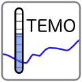
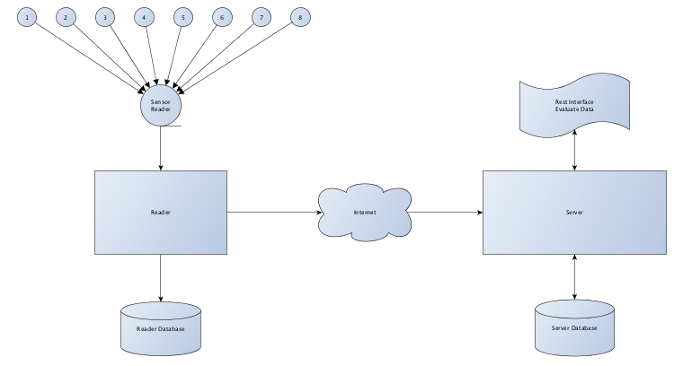

# Temperature Monitoring

> A Collection of application for collection temperature and humidity data.  
> An application reads the sensor data and loads on an external restful server. Restful server has an interface in order to evaluate the sensor data.  
> A web application is presenting the sensor data.


## Technical Overview




## Application Overview

### Reader Application

The reader app is installed on a raspberry pi. The sensor reader is collecting the data from the sensor.

### Server Application

The server application is installed on a normal webspace (*It is programming in PHP*). The reader app sends the collected sensor data to the server.

### Viewer Application

> not yet implemented

The viewer application is a interface for requesting the sensor data.

### Temperature Monitor

The temperature monitor is a web application in order to present the sensor data.


## License

```
The MIT License (MIT)

Copyright (c) 2015 BlueSkyFish

Permission is hereby granted, free of charge, to any person obtaining a copy
of this software and associated documentation files (the "Software"), to deal
in the Software without restriction, including without limitation the rights
to use, copy, modify, merge, publish, distribute, sublicense, and/or sell
copies of the Software, and to permit persons to whom the Software is
furnished to do so, subject to the following conditions:

The above copyright notice and this permission notice shall be included in
all copies or substantial portions of the Software.

THE SOFTWARE IS PROVIDED "AS IS", WITHOUT WARRANTY OF ANY KIND, EXPRESS OR
IMPLIED, INCLUDING BUT NOT LIMITED TO THE WARRANTIES OF MERCHANTABILITY,
FITNESS FOR A PARTICULAR PURPOSE AND NONINFRINGEMENT. IN NO EVENT SHALL THE
AUTHORS OR COPYRIGHT HOLDERS BE LIABLE FOR ANY CLAIM, DAMAGES OR OTHER
LIABILITY, WHETHER IN AN ACTION OF CONTRACT, TORT OR OTHERWISE, ARISING FROM,
OUT OF OR IN CONNECTION WITH THE SOFTWARE OR THE USE OR OTHER DEALINGS IN
THE SOFTWARE.
```

## Note

This project is still in progress. Using on your own risk
